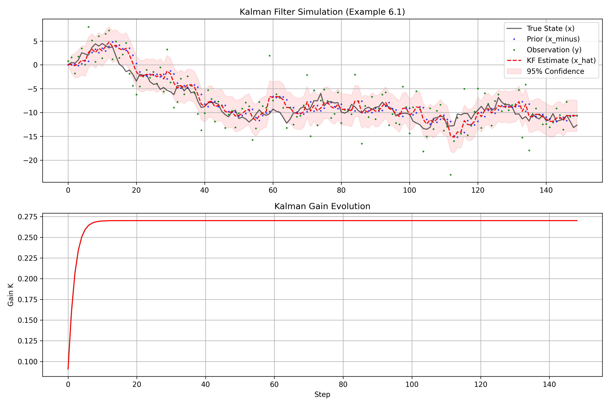
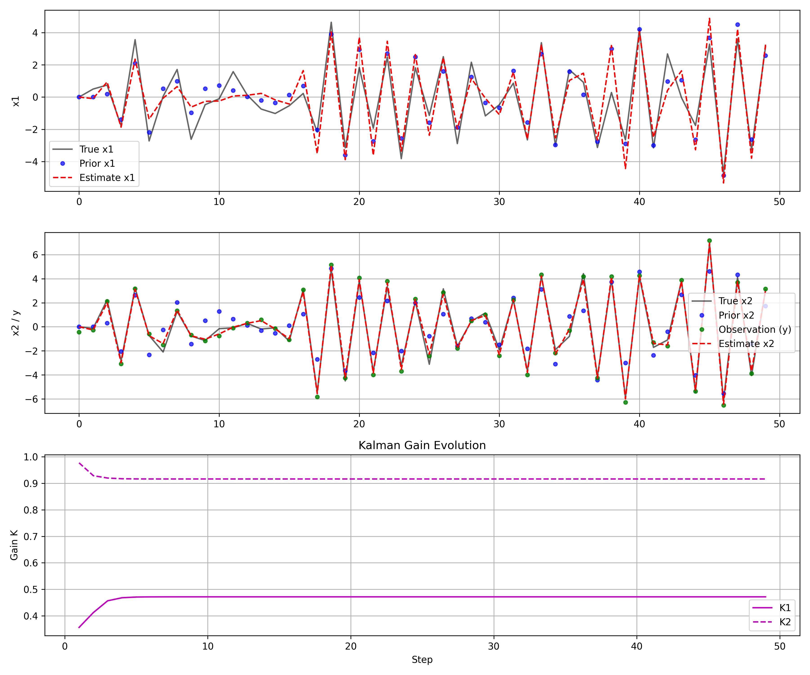
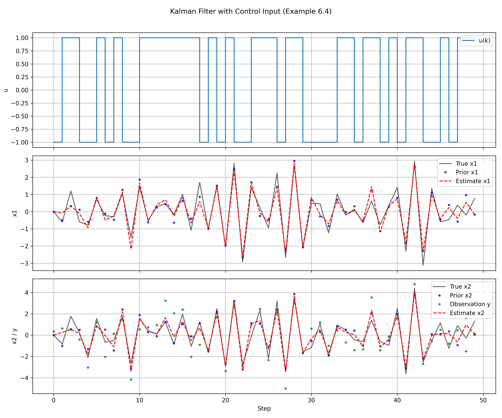
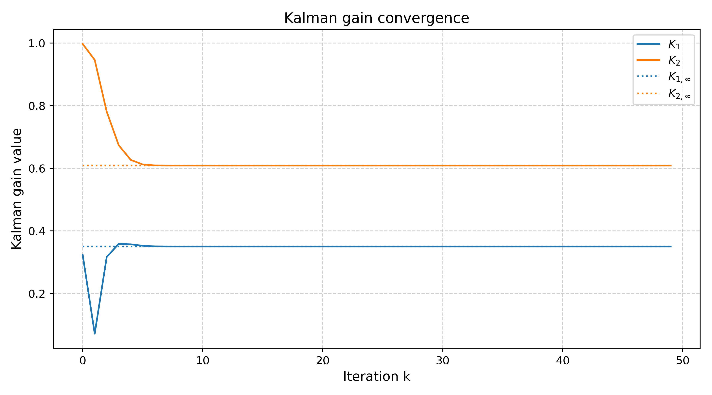
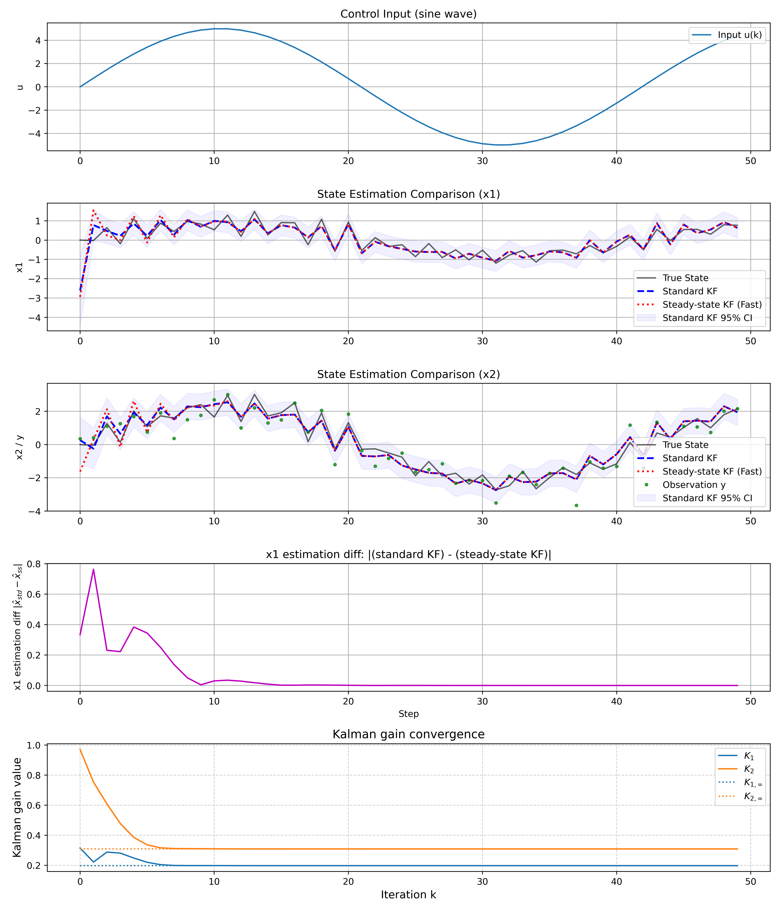

# study_kalman_filter

カルマンフィルタの勉強

## 参考書

[カルマンフィルタの基礎 - 東京電機大学出版局](https://www.tdupress.jp/book/b349390.html#bookContents)

### 例題6.1 : ウィナー過程（ブラウン運動）

### 例題6.3 : 2次系の状態推定

### 例題6.4 : 制御入力uあり

### 定常カルマンゲインへの収束

### 通常のカルマンフィルタと定常カルマンフィルタの比較（制御入力u付き）

